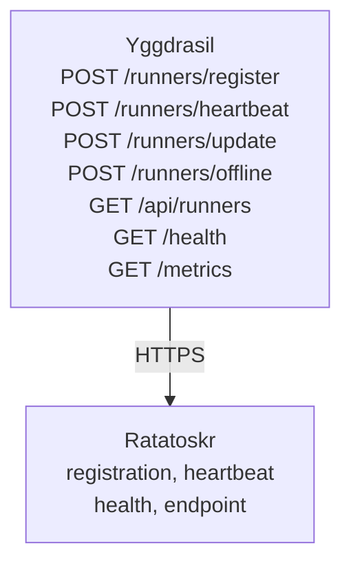

# Yggdrasil — Implementation Plan

## Overview

Yggdrasil is an Nx monorepo with two packages:

| Package | npm | Role |
|---------|-----|------|
| `packages/yggdrasil` | `@theaiinc/yggdrasil` | Orchestration server — receives runner registrations and heartbeats |
| `packages/ratatoskr` | `@theaiinc/yggdrasil-ratatoskr` | Runner daemon — registers and heartbeats with Yggdrasil |

## Architecture



## Key Decisions

### Ratatoskr connects outbound

Runners never need inbound ports. Ratatoskr makes HTTP(S) requests to Yggdrasil. This means:
- Works across NAT, firewalls, VPNs
- No reverse proxy needed per runner
- Runners can be laptops, cloud VMs, Docker containers, or edge devices

### Lease-based offline detection

Yggdrasil does not probe runners. It relies on heartbeats:
- Runner sends `POST /runners/heartbeat` every N seconds
- Yggdrasil tracks `lastHeartbeat` timestamp
- If `now - lastHeartbeat > LEASE_TTL_MS`, runner is marked `offline`
- Ratatoskr re-registers automatically if lease expires

### API key authentication

- Yggdrasil reads `API_KEYS` from environment (comma-separated)
- Ratatoskr sends `X-API-Key` header on every request
- Endpoints `/health` and `/metrics` are public

## Package Structure

```
yggdrasil/
├── package.json              # Nx workspace root
├── nx.json                   # Nx config
├── .env                      # Local env vars (gitignored)
├── .env.example              # Template for contributors
├── docker-compose.yml        # Full stack: yggdrasil + ratatoskr + monitoring
├── packages/
│   ├── yggdrasil/            # @theaiinc/yggdrasil
│   │   ├── Dockerfile
│   │   ├── package.json
│   │   ├── tsconfig.json
│   │   ├── src/
│   │   │   ├── orchestration-controller.ts   # Main Express server
│   │   │   ├── index.ts                      # Barrel exports
│   │   │   ├── services/
│   │   │   │   └── logger.ts                 # Winston logger
│   │   │   └── types/
│   │   │       └── index.ts                  # Shared types
│   │   └── prometheus.yml                    # Prometheus scrape config
│   └── ratatoskr/            # @theaiinc/yggdrasil-ratatoskr
│       ├── Dockerfile
│       ├── package.json
│       ├── tsconfig.json
│       └── src/
│           ├── runner.ts              # CLI entrypoint
│           ├── ratatoskr.ts           # Main daemon class
│           ├── transports/
│           │   ├── http-transport.ts  # HTTP transport
│           │   └── transport.ts       # Transport interface
│           ├── services/
│           │   ├── registrar.ts       # Registration lifecycle
│           │   ├── heartbeat-sender.ts
│           │   ├── endpoint-detector.ts
│           │   ├── health-monitor.ts
│           │   ├── lease-manager.ts
│           │   └── retry-manager.ts
│           └── types/
│               └── index.ts
└── scripts/
    └── e2e-lifecycle.mjs     # Zero-dep E2E test
```

## Yggdrasil API Endpoints

| Method | Path | Auth | Description |
|--------|------|------|-------------|
| `GET` | `/health` | No | Server health + runner counts |
| `GET` | `/metrics` | No | Prometheus metrics |
| `POST` | `/runners/register` | Yes | Register a new runner |
| `POST` | `/runners/heartbeat` | Yes | Send a heartbeat |
| `POST` | `/runners/update` | Yes | Update runner endpoint |
| `POST` | `/runners/offline` | Yes | Deregister a runner |
| `GET` | `/api/runners` | Yes | List all runners |
| `GET` | `/api/runners/:id` | Yes | Get runner details |

## Ratatoskr Configuration

```typescript
const ratatoskr = new Ratatoskr({
  yggdrasilUrl: 'http://localhost:3000',  // required
  apiKey: '...',                          // optional, for auth
  name: 'my-runner',                       // optional
  capabilities: ['http', 'health'],        // optional
  heartbeatInterval: 15,                   // seconds
  leaseTtl: 45,                            // seconds
  detectLocalIp: true,
  detectPublicIp: false,
});
```

## Docker Compose

```yaml
services:
  orchestration-controller:  # Yggdrasil server
    build: packages/yggdrasil
    ports: ['3000:3000']
    environment:
      - API_KEYS=${YGGDRASIL_API_KEY}
      - LEASE_TTL_MS=60000

  ratatoskr:                 # Runner daemon
    build: packages/ratatoskr
    environment:
      - YGGDRASIL_URL=http://orchestration-controller:3000
      - API_KEY=${YGGDRASIL_API_KEY}

  prometheus:                # Monitoring
  grafana:
  redis:
```

## E2E Test

`scripts/e2e-lifecycle.mjs` tests the full lifecycle end-to-end using only Node.js stdlib:

1. Starts Yggdrasil — verifies 0 runners
2. Starts Ratatoskr — verifies it registers as `online`
3. Verifies heartbeat timestamp advances
4. Kills Ratatoskr — verifies lease expiry marks it `offline`
5. Verifies auth enforcement
6. Cleans up

## Published Packages

| Package | npm | Version |
|---------|-----|---------|
| `@theaiinc/yggdrasil` | [npm](https://www.npmjs.com/package/@theaiinc/yggdrasil) | 0.3.0 |
| `@theaiinc/yggdrasil-ratatoskr` | [npm](https://www.npmjs.com/package/@theaiinc/yggdrasil-ratatoskr) | 0.3.0 |
| `@theaiinc/yggdrasil-runtime` | [npm](https://www.npmjs.com/package/@theaiinc/yggdrasil-runtime) | 0.1.1 |

## Future Work

- Persistent storage for runner state (SQLite, Redis)
- TLS/HTTPS support
- Runner labels for filtering/grouping
- WebSocket transport option for real-time
- Multi-region Yggdrasil replication
- Load balancing across runners
