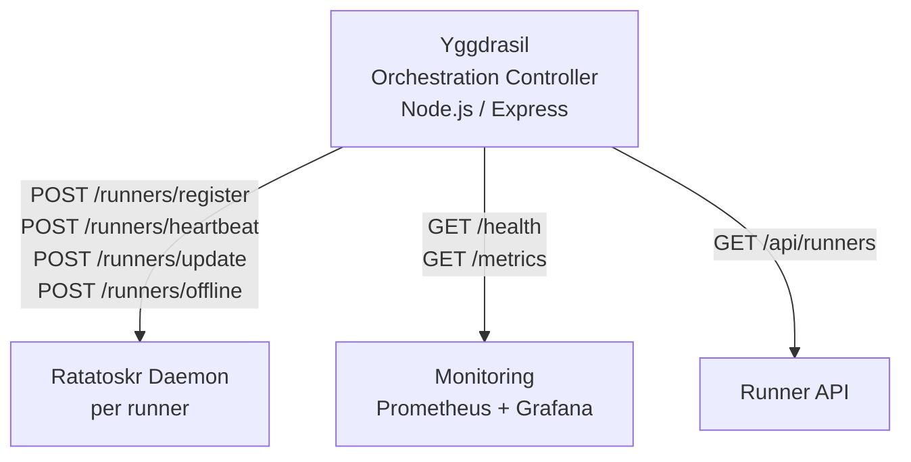

# @theaiinc/yggdrasil — Distributed Runner Orchestration

<p align="center">
  <a href="https://github.com/theaiinc/yggdrasil"></a>
  <a href="https://www.npmjs.com/package/@theaiinc/yggdrasil"></a>
  <a href="https://www.npmjs.com/package/@theaiinc/yggdrasil-ratatoskr"></a>
  <a href="https://github.com/theaiinc/yggdrasil/blob/main/LICENSE"></a>
</p>

<p align="center">
  
</p>

Yggdrasil is the orchestration controller that receives runner registrations and heartbeats from [Ratatoskr](https://github.com/theaiinc/yggdrasil-ratatoskr) daemons. Ratatoskr runs alongside each runner (any machine, anywhere) and keeps Yggdrasil informed of its availability.

## Architecture



Ratatoskr runs alongside each runner and automatically:

- Registers the runner with Yggdrasil on startup
- Sends periodic heartbeats
- Updates endpoint on IP changes
- Deregisters on graceful shutdown

Yggdrasil tracks runner state via lease-based offline detection — if a heartbeat doesn't arrive within `LEASE_TTL_MS`, the runner is automatically marked `offline`.

## Quick Start

```bash
# Build and start the full stack
docker compose up --build

# Yggdrasil API is at http://localhost:3000
curl http://localhost:3000/health
```

### Run Ratatoskr on another machine

```bash
# On any machine with Node.js:
YGGDRASIL_URL=https://your-yggdrasil-server.com:3000 \
API_KEY=your-api-key \
npx @theaiinc/yggdrasil-ratatoskr
```

## API Key Authentication

Set `API_KEYS` environment variable (comma-separated). All endpoints except `/health` and `/metrics` require the `X-API-Key` header.

```bash
API_KEYS=my-secret-key docker compose up
curl -H "X-API-Key: my-secret-key" http://localhost:3000/api/runners
```

## Configuration via `.env`

```env
# Yggdrasil API key for Ratatoskr authentication
YGGDRASIL_API_KEY=my-secret-key

# Yggdrasil server URL for Ratatoskr to register against.
# Can be local or remote over the internet.
YGGDRASIL_URL=http://localhost:3000
```

## Packages

| Package                         | npm                                                                | Description                      |
| ------------------------------- | ------------------------------------------------------------------ | -------------------------------- |
| `@theaiinc/yggdrasil`           | [npm](https://www.npmjs.com/package/@theaiinc/yggdrasil)           | Orchestration controller         |
| `@theaiinc/yggdrasil-ratatoskr` | [npm](https://www.npmjs.com/package/@theaiinc/yggdrasil-ratatoskr) | Runner discovery daemon          |
| `@theaiinc/yggdrasil-runtime`   | [npm](https://www.npmjs.com/package/@theaiinc/yggdrasil-runtime)   | ComputerUseRuntime for Cognition |

## Development

```bash
# Install dependencies
npm install

# Build packages
npm run build

# Run E2E lifecycle test
node scripts/e2e-lifecycle.mjs
```

## License

MIT
