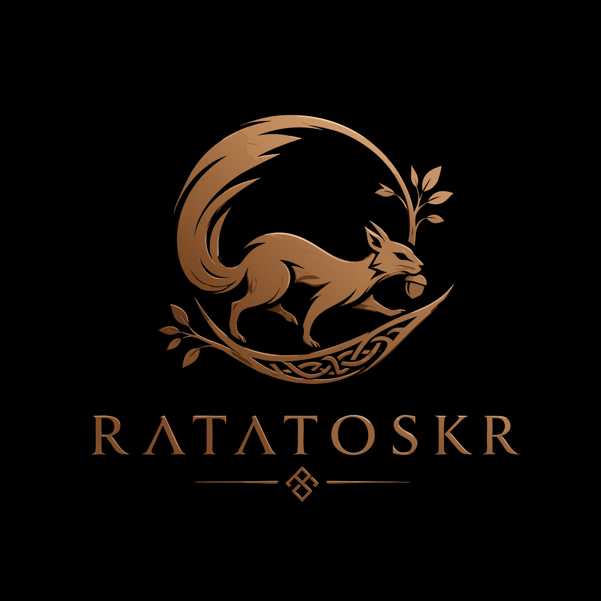

# @theaiinc/yggdrasil-ratatoskr

<p align="center">
  <a href="https://github.com/theaiinc/yggdrasil"></a>
  <a href="https://www.npmjs.com/package/@theaiinc/yggdrasil-ratatoskr"></a>
  <a href="https://github.com/theaiinc/yggdrasil/blob/main/LICENSE"></a>
</p>

<p align="center">
  
</p>

Lightweight runner daemon for Yggdrasil — registers, heartbeats, and executes tasks with configurable capability presets.

Ratatoskr runs alongside any agent (Docker container, laptop, server) and continuously informs [Yggdrasil](https://www.npmjs.com/package/@theaiinc/yggdrasil) about runner availability, capabilities, health, and task execution. It can execute tasks itself using its built-in LLM, shell, web, code, and file handlers.

> **Version note**: `@theaiinc/yggdrasil-ratatoskr` and `@theaiinc/yggdrasil` are always released at the same version number.

## Installation

```bash
npm install @theaiinc/yggdrasil-ratatoskr
```

## Quick Start

```typescript
import { Ratatoskr } from '@theaiinc/yggdrasil-ratatoskr';

const ratatoskr = new Ratatoskr({
  yggdrasilUrl: 'http://localhost:3000',
  apiKey: 'my-api-key',
});

await ratatoskr.start();
```

Within seconds, Yggdrasil knows the runner exists, its capabilities, endpoint, and health status.

### Capabilities are Presets

Capabilities define what a runner can do. Each name is a **preset** that declares its dependencies (apt, npm), environment variables, config files, task handlers, and Docker build-time preparation steps. Presets compose transitively via `dependsOn`.

Built-in presets (available by name):

| Preset | Description | Handlers | Depends On |
|--------|-------------|----------|------------|
| `llm` | LLM inference via OpenAI-compatible API | `llm` | — |
| `web_search` | Web search and fetch | `web_search`, `web_fetch` | — |
| `shell` | Shell command execution | `shell` | — |
| `agent` | Full sub-agent loop (think-act-execute) | `agent` | `llm`, `shell`, `web_search` |
| `code` | Code generation and verification | `code` | `llm`, `shell`, `python`, `node_runtime` |
| `python` | Python script execution | `python` | — |
| `node_runtime` | Node.js script execution | `node` | — |
| `github_cli` | GitHub CLI operations | `github` | `shell` |
| `computer_use` | Desktop automation via Realm ubuntu engine | `computer_use` | `llm` |
| `android` | Android emulator automation via Realm VM engine | `android` | `llm` |

```typescript
import { Ratatoskr } from '@theaiinc/yggdrasil-ratatoskr';

const ratatoskr = new Ratatoskr({
  yggdrasilUrl: 'http://localhost:3000',
  // 'agent' resolves transitively to agent + llm + shell + web_search
  capabilities: ['agent', 'code'],
});

await ratatoskr.start();
```

## Running via CLI

```bash
YGGDRASIL_URL=http://localhost:3000 \
CAPABILITIES=agent \
npx @theaiinc/yggdrasil-ratatoskr
```

The `YGGDRASIL_URL` can point to a remote Yggdrasil instance — Ratatoskr connects outbound.

## Full Configuration

```typescript
const ratatoskr = new Ratatoskr({
  runnerId: 'runner-a',
  name: 'MacBook Pro',
  yggdrasilUrl: 'https://yggdrasil.mycompany.com',
  apiKey: process.env['YGGDRASIL_API_KEY'],
  capabilities: ['agent', 'code'],
  heartbeatInterval: 15,
  leaseTtl: 45,
  taskPollInterval: 10,
  detectLocalIp: true,
  detectPublicIp: false,
  endpointProvider: async () => 'http://192.168.1.5:8080',
  healthProvider: async () => ({ status: 'healthy' }),
  labels: { region: 'us-east' },
  metadata: { team: 'infra' },
});

await ratatoskr.start();
```

### Configuration Options

| Option | Type | Default | Description |
|--------|------|---------|-------------|
| `runnerId` | `string` | Auto-generated | Unique runner identifier |
| `name` | `string` | hostname | Human-readable runner name |
| `yggdrasilUrl` | `string` | (required) | Yggdrasil server URL |
| `apiKey` | `string` | `''` | API key for Yggdrasil auth |
| `capabilities` | `string[]` | `[]` | Capability presets (resolved transitively) |
| `heartbeatInterval` | `number` | `30` | Heartbeat interval in seconds |
| `leaseTtl` | `number` | `60` | Lease TTL in seconds |
| `taskPollInterval` | `number` | `10` | Task poll interval in seconds (0 = disable) |
| `taskHandlers` | `Record<string, TaskHandler>` | `{}` | Custom task handlers (overrides presets) |
| `detectLocalIp` | `boolean` | `true` | Auto-detect local IP |
| `detectPublicIp` | `boolean` | `false` | Auto-detect public IP |
| `endpointProvider` | `() => Promise<string>` | `undefined` | Custom endpoint resolver |
| `healthProvider` | `() => Promise<HealthResult>` | `undefined` | Custom health check |
| `labels` | `Record<string, string>` | `{}` | Additional labels |
| `metadata` | `Record<string, unknown>` | `{}` | Additional metadata |

## Capability Presets System

Presets are the core of Ratatoskr's flexibility. Each preset is a JSON-like descriptor:

```typescript
import type { CapabilityPreset, CombinedPreset } from '@theaiinc/yggdrasil-ratatoskr';
```

### Preset Structure

```typescript
interface CapabilityPreset {
  name: string;
  description?: string;
  dependsOn?: string[];           // Transitive dependencies
  apt?: string[];                 // apt packages (Docker build)
  npm?: string[];                 // npm packages (Docker build)
  environment?: Record<string, {  // Env vars with defaults
    description: string;
    default?: string;
    required?: boolean;
  }>;
  files?: PresetFile[];           // Config files (Docker build)
  handlers?: Record<string, PresetHandler>;  // Task handlers
  prepare?: string[];             // Docker RUN commands
}
```

### Resolving Capabilities

```typescript
import { resolveCapabilities, applyPresetDefaults } from '@theaiinc/yggdrasil-ratatoskr';

const { capabilities, combined } = resolveCapabilities(['agent', 'code']);
// capabilities => ['agent', 'llm', 'shell', 'web_search', 'code', 'python', 'node_runtime']

// Apply environment defaults to process.env
applyPresetDefaults(combined);
```

### Combining Presets

```typescript
import { combinePresets, generateDockerfile, getPreset } from '@theaiinc/yggdrasil-ratatoskr';

const combined = combinePresets(getPreset('llm'), getPreset('shell'));

// Generate a Dockerfile with all dependencies baked in
const dockerfile = generateDockerfile(combined, {
  baseImage: 'node:20-alpine',
  port: 3100,
});
```

### Registering Custom Presets

```typescript
import { registerPreset, getPreset } from '@theaiinc/yggdrasil-ratatoskr';
import type { CapabilityPreset } from '@theaiinc/yggdrasil-ratatoskr';

registerPreset({
  name: 'my-tool',
  description: 'Custom tool with binary',
  apt: ['ffmpeg'],
  environment: {
    MY_TOOL_PATH: { description: 'Path to config', default: '/etc/my-tool' },
  },
  handlers: {
    my_tool: { module: './handlers/my-tool.js', export: 'myToolHandler' },
  },
});

const preset = getPreset('my-tool');
```

## Task Execution

Ratatoskr polls Yggdrasil for assigned tasks and executes them using registered handlers. Each capability preset maps to one or more task handlers.

### Built-in Task Output Format

All built-in handlers return structured metadata:

| Handler | Metadata Fields |
|---------|----------------|
| `llm` | `{ model, usage: { input, output }, response }` |
| `agent` | `{ final_message, model, tokens: { input, output } }` |
| `shell` | `{ stdout, stderr, code }` |
| `web_search` | `{ results }` |
| `web_fetch` | `{ content }` |
| `python` | `{ stdout, stderr, code }` |
| `node` | `{ stdout, stderr, code }` |
| `github` | `{ stdout, stderr, code }` |
| `computer_use` | `{ goal, realmId, engine, iterations, actions }` |
| `android` | `{ goal, realmId, engine, iterations, actions }` |

> **Cost tracking**: Cost is computed server-side by the orchestration layer (e.g. Oasis api-gateway's `PricingService`). Ratatoskr reports the actual model used and token counts — the server applies per-model pricing.

### Custom Task Handlers

```typescript
import { Ratatoskr } from '@theaiinc/yggdrasil-ratatoskr';
import type { TaskHandler } from '@theaiinc/yggdrasil-ratatoskr';

const echoHandler: TaskHandler = async (task) => {
  return {
    status: 'completed',
    metadata: {
      message: task.metadata?.message || 'hello',
    },
  };
};

const ratatoskr = new Ratatoskr({
  yggdrasilUrl: 'http://localhost:3000',
  capabilities: ['agent'],
  taskHandlers: { echo: echoHandler },
});
```

## Agent Sub-Agent Loop

When the `agent` capability is active, Ratatoskr runs a full think-act-execute loop:

1. **Think**: LLM receives the goal + available tools
2. **Act**: LLM emits a `tool` block → handler executes
3. **Observe**: Result is fed back to the LLM
4. **Repeat**: Until the LLM emits a `final` block or max iterations reached

The agent has access to: `shell`, `read_file`, `write_file`, `web_search`, `web_fetch`, `python`, `node`, `github` tools.

## Environment Variables (CLI Runner)

| Variable | Default | Description |
|----------|---------|-------------|
| `YGGDRASIL_URL` | `http://localhost:3000` | Yggdrasil server URL |
| `API_KEY` | `''` | API key for authentication |
| `RUNNER_NAME` | `ratatoskr-<hostname>` | Human-readable runner name |
| `CAPABILITIES` | `agent` | Comma-separated capability presets |
| `LLM_MODEL` | `google/gemma-4-26b-a4b-qat` | Model for LLM inference |
| `LLM_BASE_URL` | `http://host.docker.internal:1234/v1` | OpenAI-compatible base URL |
| `LLM_API_KEY` | `''` | API key (optional for local LM Studio) |
| `AGENT_MAX_TOOL_ITERATIONS` | `25` | Max tool call cycles per agent task |
| `REALM_URL` | `http://localhost:8542` | Realm API server URL (for `computer_use` / `android`) |
| `REALM_ID` | `''` | Existing realm to reuse (optional) |
| `REALM_AVD` | `Pixel_9_Pro` | Android Virtual Device name (for `android`) |
| `CU_MAX_ITERATIONS` | `50` | Max screenshot-action cycles per automation task |

## Realm Integration

`computer_use` and `android` capabilities talk to [@theaiinc/realm-api](https://github.com/theaiinc/theaiincrealm) over the universal `/api/v1/realms/:id/*` interface:

| Preset | Realm Engine | Use Case |
|--------|-------------|----------|
| `computer_use` | `ubuntu` | Desktop automation (XFCE + xdotool) |
| `android` | `vm` | Android emulator automation (ADB + Realm Agent APK) |

```typescript
const ratatoskr = new Ratatoskr({
  yggdrasilUrl: 'http://localhost:3000',
  capabilities: ['android', 'llm'],
});

// Task metadata for an Android automation goal:
// { type: 'android', metadata: { goal: 'Open Settings and enable Wi-Fi' } }
```

Start the Realm API server first (`pnpm realm:api` in theaiincrealm repo). For Android, use the `wip/android-vm` branch which registers `VMEngine`.

## Services

| Service | Description |
|---------|-------------|
| `Registrar` | Runner registration lifecycle |
| `HeartbeatSender` | Periodic heartbeat sender |
| `TaskExecutor` | Task polling and execution |
| `EndpointDetector` | IP/hostname change detection |
| `HealthMonitor` | Health check orchestration |
| `LeaseManager` | Lease expiry tracking |
| `RetryManager` | Exponential backoff retry |
| `ResourceCollector` | CPU/memory/uptime collection |
| `UpdateManager` | Self-update on Yggdrasil signal |
| `HttpTransport` | HTTP transport with API key support |

## Self-Update

Ratatoskr can update itself when Yggdrasil signals a pending update via heartbeat response. The update is deferred until all current tasks complete.

```typescript
// Yggdrasil admin API:
POST /runners/:id/request-update
{ "version": "0.3.0", "command": "npm update -g @theaiinc/yggdrasil-ratatoskr" }
```

On the next heartbeat, the runner receives the `pendingUpdate` field, finishes its tasks, runs the update command, and restarts.

## How It Works

1. **`ratatoskr.start()`** — Resolves capability presets, registers with Yggdrasil, begins heartbeats, starts task polling
2. **Heartbeats** — Sent every N seconds with health, resources, and current tasks
3. **Lease** — Each registration has a TTL; Yggdrasil marks runner `offline` on timeout
4. **Task polling** — Polls `GET /runners/:id/tasks` for tasks in `running` status every N seconds
5. **Task execution** — Dispatches to registered handler by task type, reports completion via `PATCH`
6. **IP Changes** — Detected every 10 seconds; Yggdrasil notified via `POST /runners/update`
7. **Graceful Shutdown** — On SIGTERM/SIGINT, deregisters with `POST /runners/offline`

## Reliability

Ratatoskr is designed to survive:
- Temporary network outages (exponential backoff)
- Yggdrasil restarts (automatic re-registration)
- IP changes (dynamic endpoint updates)
- Laptop sleep/wake cycles
- Docker container restarts

## Public API (Export Summary)

```typescript
// Classes
import { Ratatoskr } from '@theaiinc/yggdrasil-ratatoskr';
import { HttpTransport, EndpointDetector, HealthMonitor, HeartbeatSender,
         LeaseManager, Registrar, RetryManager, ResourceCollector,
         TaskExecutor, UpdateManager } from '@theaiinc/yggdrasil-ratatoskr';

// Preset system
import { registerPreset, getPreset, listPresets, combinePresets,
         generateDockerfile, applyPresetDefaults, resolveCapabilities } from '@theaiinc/yggdrasil-ratatoskr';
import type { CapabilityPreset, CombinedPreset, DockerfileOptions,
              PresetEnvVar, PresetHandler, PresetFile } from '@theaiinc/yggdrasil-ratatoskr';

// Built-in presets
import { llm, webSearch, shell, agent, codeRunner, python,
         nodeRuntime, githubCli } from '@theaiinc/yggdrasil-ratatoskr';

// Types
import type { Transport, RatatoskrConfig, RatatoskrState, RunnerRegistration,
              HeartbeatPayload, HeartbeatResponse, PendingUpdate,
              HealthResult, SystemResources, RunnerTask,
              TaskHandler, TaskExecutorConfig } from '@theaiinc/yggdrasil-ratatoskr';
import { RunnerHealth } from '@theaiinc/yggdrasil-ratatoskr';
```

## License

MIT — © 2026 The AI Inc
