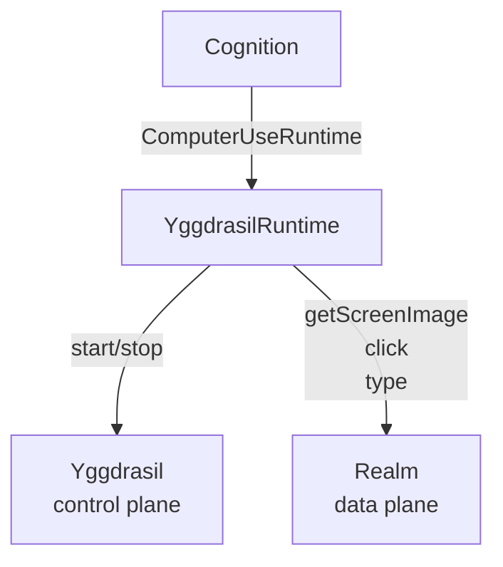

# @theaiinc/yggdrasil-runtime

<p align="center">
  <a href="https://github.com/theaiinc/yggdrasil"></a>
  <a href="https://www.npmjs.com/package/@theaiinc/yggdrasil-runtime"></a>
  <a href="https://github.com/theaiinc/yggdrasil/blob/main/LICENSE"></a>
</p>

<p align="center">
  
</p>

`ComputerUseRuntime` implementation that bridges [Cognition](https://github.com/theaiinc/oasis-cognition) to [Yggdrasil](https://www.npmjs.com/package/@theaiinc/yggdrasil) + [Realm](https://github.com/theaiinc/realm-api) for remote desktop automation.

This package proves the **control-plane / data-plane split**:

- **Yggdrasil** (control plane) — session create, terminate, pause, resume
- **Realm** (data plane) — observation (screenshots) and input (click, type, scroll)

Cognition never knows Yggdrasil, Ratatoskr, or Realm exist. It only sees `ComputerUseRuntime`.

## Architecture



## Installation

```bash
npm install @theaiinc/yggdrasil-runtime
```

## Quick Start

```typescript
import { YggdrasilRuntime } from '@theaiinc/yggdrasil-runtime';

const runtime = new YggdrasilRuntime({
  yggdrasilUrl: 'http://localhost:3000',
  apiKey: 'my-api-key',
  sessionType: 'computer-use',
});

// Start a session — creates via Yggdrasil
const session = await runtime.start();
console.log('Session created:', session.id);

// Observe — talks to Realm directly
const screenshot = await runtime.getScreenImage();
console.log('Screenshot captured:', screenshot ? screenshot.slice(0, 40) + '...' : 'none');

// Interact — talks to Realm directly
await runtime.click({ x: 100, y: 200 });
await runtime.type({ text: 'Hello, world!' });

// Stop — terminates via Yggdrasil
await runtime.stop();
```

## Configuration

| Option | Type | Default | Description |
|--------|------|---------|-------------|
| `yggdrasilUrl` | `string` | (required) | Yggdrasil server URL for session lifecycle |
| `apiKey` | `string` | — | API key for Yggdrasil authentication |
| `realmUrl` | `string` | from session | Realm URL override (for development) |
| `sessionType` | `'computer-use' \| 'phone-use'` | `'computer-use'` | Session type to create |
| `ownerId` | `string` | — | Owner identity for Veil authorization |
| `participantIds` | `string[]` | — | Participant identities |
| `capabilities` | `string[]` | type defaults | Requested session capabilities |

## Runbook: Proving the Architecture

This validation shows that Cognition can run unchanged against either `LocalMacOSRuntime` or `YggdrasilRuntime`:

```typescript
import { YggdrasilRuntime } from '@theaiinc/yggdrasil-runtime';

async function proveArchitecture() {
  const runtime = new YggdrasilRuntime({
    yggdrasilUrl: 'http://localhost:3000',
    apiKey: process.env['YGGDRASIL_API_KEY'],
  });

  await runtime.start();
  const image = await runtime.getScreenImage();
  await runtime.click({ x: 500, y: 400 });
  await runtime.type({ text: 'Hello from Yggdrasil!' });
  await runtime.stop();
}
```

If this works, the `ComputerUseRuntime` abstraction is validated — Cognition is fully decoupled from infrastructure.

## Development

```bash
# Install dependencies
npm install

# Build
npm run build

# Test
npm test
```

## License

MIT — © 2026 The AI Inc
